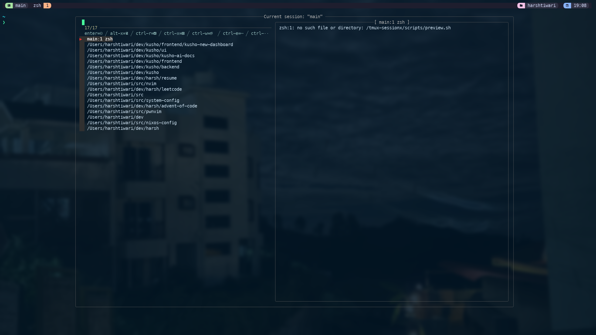

# Nix macOS Configuration

A modern, declarative macOS system configuration using nix-darwin and home-manager. This setup provides a reproducible development environment with automated system preferences, application installations, and dotfile management.



## Features

- 🍎 Automated macOS system preferences and defaults
- 🏠 Declarative user environment with home-manager
- 📦 Reproducible package management via Nix flakes
- 🔧 Development environment configuration
- ⌨️ Custom keyboard and input settings
- 🖥️ Modern terminal setup with WezTerm
- 🔄 Tmux configuration with themes and session management
- 🛠️ Comprehensive Git and shell customizations

## Prerequisites

- macOS 12 (Monterey) or later
- Command Line Tools for Xcode: `xcode-select --install`

## Installation

1. Install Nix with flakes support:

```bash
sh <(curl -L https://nixos.org/nix/install)
```

2. Enable flakes by creating or editing `~/.config/nix/nix.conf`:

```bash
mkdir -p ~/.config/nix
echo "experimental-features = nix-command flakes" >> ~/.config/nix/nix.conf
```

3. Clone and enter the repository:

```bash
git clone https://github.com/yourusername/nix-config.git ~/.config/nixpkgs
cd ~/.config/nixpkgs
```

4. Build and activate the configuration:

```bash
nix build .#darwinConfigurations.macbook.system
./result/sw/bin/darwin-rebuild switch --flake .#macbook
```

Note: Replace `macbook` with your system's hostname as defined in the flake.

## Project Structure

```
.
├── dotfiles/                    # Global dotfiles
│   ├── tmux.conf               # Tmux configuration
│   └── wezterm/                # WezTerm configuration
│       └── wezterm.lua
├── modules/
│   ├── darwin/                 # macOS configurations
│   │   └── default.nix        # System preferences
│   └── home-manager/          # User environment
│       ├── dotfiles/          # User dotfiles
│       │   └── inputrc       # Readline config
│       └── programs/         # Program configs
│           ├── core.nix      # Essential packages
│           ├── git.nix      # Git settings
│           ├── shell.nix    # Shell config
│           ├── terminal.nix # Terminal settings
│           ├── tmux/        # Tmux modules
│           │   ├── catppuccin-config.nix
│           │   ├── extraConfig.nix
│           │   ├── floax-config.nix
│           │   ├── plugins.nix
│           │   └── sessionx-config.nix
│           └── tmux.nix     # Main tmux config
├── flake.nix                   # Flake configuration
└── flake.lock                  # Dependency lock file
```

## Configuration Details

### System Settings (`modules/darwin/default.nix`)

The system configuration manages macOS preferences and defaults:

- System-wide keyboard and input settings
- Dock behavior and appearance
- Finder preferences and features
- Global system defaults and security settings

### User Environment (`modules/home-manager/`)

User-specific configurations and packages:

- Development tools and utilities
- Shell environment and aliases
- Application-specific settings
- Personal dotfiles management

### Featured Configurations

#### Terminal Setup

- WezTerm as the primary terminal emulator
- Custom theme and keybindings
- Optimized font configuration

#### Tmux Configuration

- Catppuccin theme integration
- Enhanced session management
- Productivity-focused plugins
- Custom status line and indicators

#### Development Environment

- Comprehensive Git configuration with aliases
- Shell customizations and utilities
- Development tool integrations
- Project-specific settings

## Daily Operations

Update and maintain your system:

```bash
# Update all flake inputs
nix flake update

# Update specific input
nix flake lock --update-input nixpkgs

# Rebuild system
darwin-rebuild switch --flake .#macbook

# Check configuration
darwin-rebuild check --flake .#macbook

# View generation history
darwin-rebuild history
```

## Troubleshooting

Common issues and their solutions:

```bash
# Fix Nix permissions
sudo chown -R $(whoami):staff /nix

# Clean Nix store
nix-collect-garbage -d

# Remove old generations
sudo nix-collect-garbage -d
```

## Credits

Built with:

- [Nix](https://nixos.org/) - The purely functional package manager
- [nix-darwin](https://github.com/LnL7/nix-darwin) - macOS system management
- [home-manager](https://github.com/nix-community/home-manager) - User environment management
- [Catppuccin](https://github.com/catppuccin/catppuccin) - Color scheme

## License

This project is licensed under the MIT License. See the [LICENSE](LICENSE) file for details.

## Hammer spoon

defaults write org.hammerspoon.Hammerspoon MJConfigFile "~/.config/hammerspoon/init.lua"
